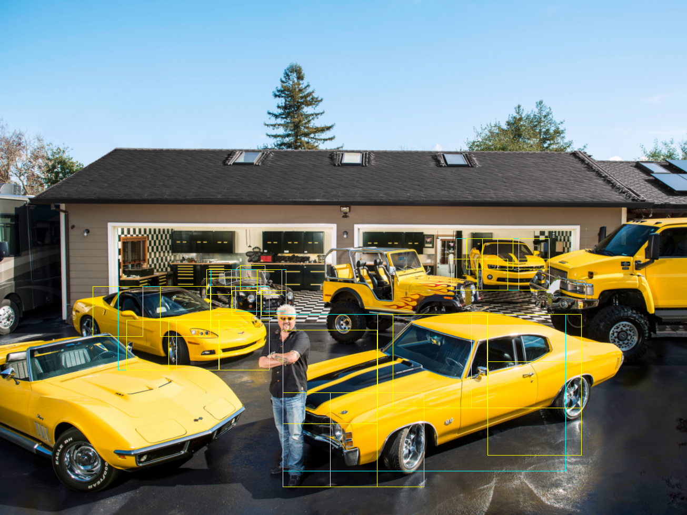

pydro
=====

Python reimplementation of some pieces of Pedro Felzenszwalb's DPM package.

Installation
-----
See Dockerfile for an example configuration.  In particular, this installation uses Ubuntu 14.04 with
the following packages installed:
* libpython-dev
* python-numpy
* build-essential
* libatlas-base-dev
* python-msgpack
* python-scipy

Once the dependencies are installed, build and install pydro:

```python setup.py build```

```python setup.py install```

Demo
-----
For example API usage, look at demo.py.  This loads an image with a bunch of cars and a model that detects cars.  The output is an image called vis.py.
Example input:

Output:

Blue boxes should appear around the cars and yellow boxes should appear around the DPM parts.
